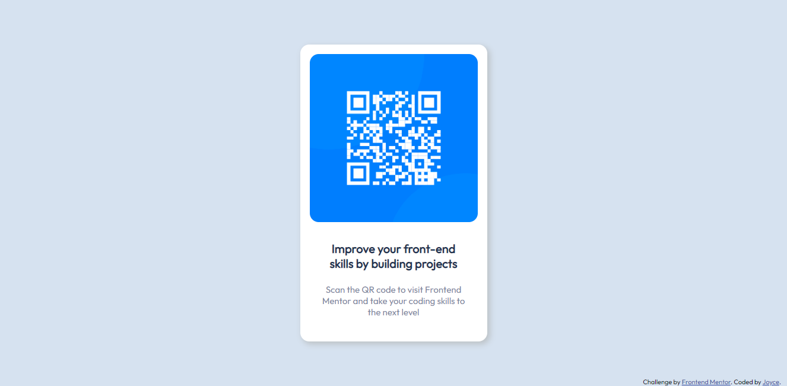

# Frontend Mentor - Challenges

This is my solution to the qr code component challenge on Frontend Mentor Website.

## Screenshot

## Links

- Solution URL:
- Live Site URL:

## Built with

- Semantic HTML5 markup
- Flexbox

## Author

- Github: https://github.com/joyce-souza
- Frontend Mentor: https://www.frontendmentor.io/profile/joyce-souza
